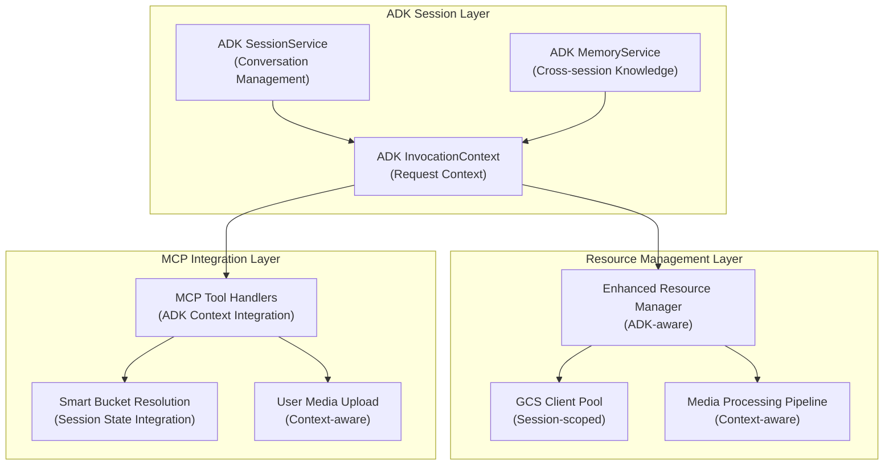

# ADK Session Management Integration Plan

## Executive Summary

This document outlines the integration strategy for replacing our custom session management implementation with ADK's native `SessionService` and `MemoryService` capabilities. The goal is to leverage ADK's built-in session and memory management while preserving our media handling improvements and resource management capabilities.

## Current State Analysis

### Custom Session Manager Implementation
Our current `session_manager.go` provides:
- **Resource Lifecycle Management**: Registration, tracking, and cleanup of GCS clients, temp files, upload streams
- **Automatic Expiration**: Timeout-based cleanup (default 30 minutes)
- **GCS Client Pooling**: Reuse of storage clients across requests
- **Background Cleanup**: Goroutine-based periodic cleanup
- **Resource Statistics**: Monitoring and reporting capabilities

### ADK Native Session Management
ADK provides comprehensive session and memory services:
- **SessionService**: Manages conversation threads with persistent state
  - `InMemorySessionService` for development
  - `VertexAiSessionService` for production
- **MemoryService**: Long-term knowledge storage across sessions
  - `InMemoryMemoryService` for testing
  - `VertexAiMemoryBankService` and `VertexAiRagMemoryService` for production
- **InvocationContext**: Request-scoped context with session state access
- **Event-driven Architecture**: Cooperative event loop between Runner and agents

## Integration Architecture

### Proposed Hybrid Approach



### Integration Strategy

1. **Preserve Resource Management**: Adapt our custom resource management to work within ADK's session lifecycle
2. **Leverage ADK State**: Use ADK's session state for conversation context and media processing state
3. **Integrate with InvocationContext**: Access session state and services through ADK's context system
4. **Maintain Backward Compatibility**: Ensure existing MCP handlers continue to work

## Implementation Plan

### Phase 1: ADK Context Integration

#### 1.1 Create ADK-Aware Resource Manager
```go
// adk_resource_manager.go
type ADKResourceManager struct {
    sessionService SessionService
    memoryService  MemoryService
    resources      map[string]*SessionResource
    mu             sync.RWMutex
}

func NewADKResourceManager(sessionSvc SessionService, memorySvc MemoryService) *ADKResourceManager {
    return &ADKResourceManager{
        sessionService: sessionSvc,
        memoryService:  memorySvc,
        resources:      make(map[string]*SessionResource),
    }
}

func (arm *ADKResourceManager) RegisterResourceWithContext(
    ctx InvocationContext, 
    resourceID string, 
    resource interface{}, 
    cleanupFunc func() error,
) error {
    // Store resource reference in ADK session state
    sessionState := ctx.GetSessionState()
    sessionState.Set(fmt.Sprintf("resource:%s", resourceID), resourceID)
    
    // Register in local resource map
    return arm.registerResource(resourceID, resource, cleanupFunc)
}
```

#### 1.2 Integrate with ADK Session State
```go
// session_state_integration.go
type SessionStateKeys struct {
    BucketName     string = "media:bucket_name"
    UploadCounter  string = "media:upload_counter"
    ProcessingJobs string = "media:processing_jobs"
    UserPrefs      string = "user:preferences"
}

func StoreBucketInSession(ctx InvocationContext, bucketName string) {
    ctx.GetSessionState().Set(SessionStateKeys.BucketName, bucketName)
}

func GetBucketFromSession(ctx InvocationContext) (string, bool) {
    value, exists := ctx.GetSessionState().Get(SessionStateKeys.BucketName)
    if !exists {
        return "", false
    }
    return value.(string), true
}
```

### Phase 2: MCP Handler Refactoring

#### 2.1 Update Veo Handlers for ADK Context
```go
// Updated veo handlers to use ADK InvocationContext
func veoImageToVideoHandlerADK(client *genai.Client, ctx InvocationContext, request mcp.CallToolRequest) (*mcp.CallToolResult, error) {
    // Get session state for bucket resolution
    bucketName, hasBucket := GetBucketFromSession(ctx)
    if !hasBucket {
        // Use smart bucket resolution with ADK context
        resolvedBucket, err := ResolveBucketWithADKContext(ctx, client)
        if err != nil {
            return mcp.NewToolResultError(fmt.Sprintf("bucket resolution failed: %v", err)), nil
        }
        bucketName = resolvedBucket
        StoreBucketInSession(ctx, bucketName)
    }
    
    // Process inline image data with ADK context
    processedImageURI, err := ProcessInlineImageWithADKContext(ctx, request.GetArguments()["image_uri"])
    if err != nil {
        return mcp.NewToolResultError(fmt.Sprintf("image processing failed: %v", err)), nil
    }
    
    // Continue with video generation...
    return generateVideoWithADKContext(ctx, client, bucketName, processedImageURI, request)
}
```

#### 2.2 Enhance Bucket Resolution with ADK Memory
```go
// bucket_resolver_adk.go
func ResolveBucketWithADKContext(ctx InvocationContext, gcsClient *storage.Client) (string, error) {
    // Check session state first
    if bucket, exists := GetBucketFromSession(ctx); exists {
        return bucket, nil
    }
    
    // Check ADK memory for user preferences
    memoryService := ctx.GetMemoryService()
    userBucketPref, err := memoryService.SearchMemory("user bucket preference")
    if err == nil && len(userBucketPref) > 0 {
        bucket := extractBucketFromMemory(userBucketPref[0])
        if bucket != "" {
            StoreBucketInSession(ctx, bucket)
            return bucket, nil
        }
    }
    
    // Fall back to environment and default resolution
    return resolveFromEnvironmentAndDefault(gcsClient)
}
```

### Phase 3: Memory Service Integration

#### 3.1 Store Media Processing History
```go
// memory_integration.go
func StoreMediaProcessingInMemory(ctx InvocationContext, operation string, details map[string]interface{}) error {
    memoryService := ctx.GetMemoryService()
    
    // Create memory entry for media operation
    memoryEntry := map[string]interface{}{
        "operation":  operation,
        "timestamp":  time.Now(),
        "details":    details,
        "session_id": ctx.GetSessionID(),
        "user_id":    ctx.GetUserID(),
    }
    
    // Add to memory service for cross-session recall
    return memoryService.AddToMemory("media_processing_history", memoryEntry)
}

func RecallSimilarMediaOperations(ctx InvocationContext, query string) ([]interface{}, error) {
    memoryService := ctx.GetMemoryService()
    return memoryService.SearchMemory(fmt.Sprintf("media_processing_history %s", query))
}
```

### Phase 4: Enhanced Error Handling and Monitoring

#### 4.1 ADK-Aware Error Handling
```go
// error_handling_adk.go
func HandleMediaProcessingError(ctx InvocationContext, operation string, err error) error {
    // Log error with ADK context
    logger := ctx.GetLogger()
    logger.Error("Media processing error", 
        "operation", operation,
        "error", err,
        "session_id", ctx.GetSessionID(),
        "user_id", ctx.GetUserID(),
    )
    
    // Store error in session state for retry logic
    errorState := ctx.GetSessionState()
    errorState.Set(fmt.Sprintf("error:%s", operation), map[string]interface{}{
        "error":     err.Error(),
        "timestamp": time.Now(),
        "retries":   0,
    })
    
    // Add to memory for pattern analysis
    StoreMediaProcessingInMemory(ctx, "error", map[string]interface{}{
        "operation": operation,
        "error":     err.Error(),
    })
    
    return err
}
```

## Migration Strategy

### Step 1: Parallel Implementation
- Implement ADK-aware components alongside existing custom session manager
- Add feature flags to switch between implementations
- Maintain backward compatibility during transition

### Step 2: Gradual Migration
- Start with new MCP handlers using ADK context
- Migrate existing handlers one by one
- Validate functionality at each step

### Step 3: Resource Manager Integration
- Integrate custom resource management with ADK session lifecycle
- Ensure cleanup happens when ADK sessions end
- Maintain GCS client pooling efficiency

### Step 4: Testing and Validation
- Comprehensive testing with both session management approaches
- Performance comparison between custom and ADK implementations
- Validation of memory persistence and cross-session functionality

## Benefits of Integration

### 1. Native ADK Ecosystem Integration
- Seamless integration with ADK's agent lifecycle
- Access to ADK's built-in memory and state management
- Compatibility with ADK's multi-agent orchestration

### 2. Enhanced Persistence
- Cross-session memory for user preferences and media history
- Persistent conversation state across agent restarts
- Integration with Vertex AI Memory Bank for production

### 3. Improved Observability
- Integration with ADK's event system for better debugging
- Trace capabilities for media processing operations
- Session state inspection through ADK tools

### 4. Scalability and Production Readiness
- Vertex AI Session Service for production deployments
- Cloud-native state persistence
- Integration with Google Cloud monitoring and logging

## Risk Mitigation

### 1. Backward Compatibility
- Maintain existing MCP handler interfaces
- Gradual migration with fallback mechanisms
- Comprehensive testing of existing functionality

### 2. Performance Considerations
- Monitor resource management overhead
- Optimize GCS client pooling with ADK context
- Ensure cleanup efficiency is maintained

### 3. Error Handling
- Robust error handling for ADK service failures
- Fallback to local state when ADK services unavailable
- Clear error messages for debugging

## Success Metrics

1. **Functional Compatibility**: All existing media handling features work with ADK integration
2. **Performance Parity**: No significant performance degradation compared to custom implementation
3. **Enhanced Capabilities**: New features enabled by ADK memory and state management
4. **Code Maintainability**: Reduced custom code complexity through ADK service usage
5. **Production Readiness**: Successful deployment with Vertex AI services

## Timeline

- **Week 1-2**: Phase 1 - ADK Context Integration
- **Week 3-4**: Phase 2 - MCP Handler Refactoring  
- **Week 5-6**: Phase 3 - Memory Service Integration
- **Week 7-8**: Phase 4 - Error Handling and Testing
- **Week 9-10**: Migration and Validation

This integration plan provides a structured approach to leveraging ADK's native session management while preserving our media handling improvements and ensuring production readiness.
